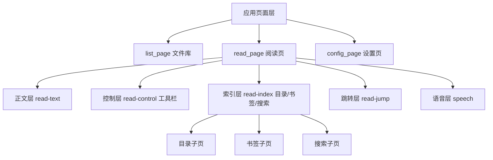

# tiansh/reader（tReader）UI 布局与信息架构分析

分析对象：[tiansh/reader](https://github.com/tiansh/reader)（本文分析时使用的版本对应仓库 `master` 分支）。

## 一句话结论

tReader 是一个纯前端 TXT 阅读器，没有后端、没有构建步骤，打开 `src/` 就能跑。它的界面由“三个全屏应用页面 + 阅读页内五层叠层”组织起来：主界面管书库，设置页管配置，阅读页把所有阅读功能叠在正文之上。最值得借鉴的两点：一是同一套目录组件在窄屏变成全屏面板、在宽屏变成固定侧栏，只靠一个 CSS 类切换；二是工具栏默认隐藏，需要时再唤出，让正文始终是界面主角。

## 1. 项目与代码地图

tReader 的 UI 全部是原生 HTML/CSS/JS，模块通过 ES Module 组织，核心文件如下。

| 文件 | 职责 |
| --- | --- |
| `src/index.html` | 唯一宿主页面，包含全部页面容器、叠层结构和 `<template>` 组件模板 |
| `src/js/page/router.js` | hash 路由（`#!`），负责页面切换、URL 恢复 |
| `src/js/page/page.js` | `Page` 基类，统一页面生命周期 |
| `src/js/page/list/listpage.js` | 主界面（文件库） |
| `src/js/page/read/readpage.js` | 阅读页总指挥，组合正文、控制、索引、跳转、语音 |
| `src/js/page/read/control/controlpage.js` | 阅读工具栏 |
| `src/js/page/read/index/indexpage.js` | 目录/书签/搜索三个索引子页的容器 |
| `src/js/page/config/configpage.js` | 设置页，含多级选项子页 |
| `src/js/ui/component/menu.js` | 全屏弹层菜单组件 |
| `src/css/page/readpage.css` | 阅读页叠层、侧栏宽度、宽屏工具栏旋转等核心布局 |
| `src/css/common/main.css` | 全页通用的 header/footer/item-list 样式 |

## 2. 总体信息架构

### 2.1 三级结构

tReader 的信息架构可以概括为“应用页面 → 阅读子层 → 索引子页”三级，但用户感知上始终以全屏阅读为主体，工具只在需要时出现。

### 2.2 应用页面层

`#pages` 下只有三个 `.page` 容器，全部绝对定位、默认 `display: none`，当前页加 `.active-page`。切换页面通过 `router.go('list' | 'read' | 'config')` 完成，路由是 hash 形式，刷新后能恢复页面和阅读位置。

三个页面的定位很干净：文件库负责“找书”，阅读页负责“读书”，设置页负责“调偏好”。互相之间没有耦合，设置页甚至可以在阅读时以覆盖层方式叠在阅读页之上。

### 2.3 阅读页的五个叠层

阅读页 `#read_page` 内部不按“区块”排布，而是按“优先级”叠放，每一层都是一个全屏绝对定位的 `.read-layer`：

| 层级 | DOM 容器 | 视觉层级 | 功能 |
| --- | --- | --- | --- |
| 正文 | `.read-text` | 最底层（z-index 2） | 翻页/滚动阅读内容 |
| 控制 | `.read-control` | 中层偏上（z-index 8/9） | 顶部返回栏 + 底部工具栏 |
| 索引 | `.read-index` | 上层（z-index 9） | 目录、书签、搜索 |
| 跳转 | `.read-jump` | 上层 | 底部跳转条 |
| 弹层 | `#screen_menu` | 最顶层 | 全屏菜单 |

这种“叠层”而不是“分栏”的设计是 tReader 最核心的布局思路：正文永远占满整屏，任何工具面板都从上方盖过来，收起后正文区域不需要重新计算布局，因此不会出现“隐藏面板后留白”的问题。

## 3. 各区域布局分析

### 3.1 主界面（文件库）

主界面是一屏到底的文件列表页：

- 顶部 `.header-line`：左侧“添加”按钮，中间标题，右侧“设置”按钮。左右固定，中间自动居中，标题过长时省略号截断。
- 筛选行：搜索框 + 排序按钮，排序用全屏菜单选择“最近阅读/最近添加/标题”。
- 内容区 `#file_list`：列表高度为 `页面高度 - 50px`，自身滚动；每项固定 60px 高，标题 24px 加粗，下面一行显示日期和进度。
- 拖拽导入：拖入文件时全屏显示 `#drop_area` 遮罩，松手后导入。
- 导入提示：首次导入时显示底部浮层提示，可关闭。

值得注意的细节：隐藏文件输入框 `#file` 放在 `top: -1000px`，通过“添加”按钮触发；列表滚动位置用一个 1px 的 `#file_list_sensor` 保留，返回列表时能回到原位置。

### 3.2 阅读界面整体

阅读页是五个叠层的组合，交互上有一个统一规则：默认只显示正文；点按或双击唤出工具栏；工具栏显示时，正文被一个透明全屏按钮 `.read-control-cover` 盖住，点任意空白处关闭。这样“正文优先”和“随时可退出”同时成立。

阅读页在宽度 ≥ 960px 时自动切到“宽屏模式”（`read-page-wide`），否则是“窄屏模式”（`read-page-thin`）。这个切换只改一个类，CSS 自动完成全部重排，是响应式布局的范例。

### 3.3 侧边栏 / 目录

目录（连同书签、搜索）是阅读页的索引层，布局有两种形态：

- 窄屏：整个索引层变成全屏页面，宽度 `100vw`，从左侧滑入；底部有 Tab 栏（目录/书签/搜索），可以点击或横向滑动切换，Tab 高亮位置用 CSS 变量 `--tab-index-current` 驱动。
- 宽屏：索引层变成左侧固定侧栏。侧栏宽度由 CSS 变量 `--index-width` 控制：960px 以上 300px，1200px 以上 `25vw`，2000px 以上 500px。正文层通过 `read-page-wide.read-show-index .read-layer { left: var(--index-width) }` 整体让位，侧栏永远不遮挡正文。

同一套组件、同一个 DOM，只靠 `read-page-wide` / `read-page-thin` 两个类完成“全屏面板 ↔ 固定侧栏”的切换，是这套 UI 里最值得抄的模式。

目录列表本身有两个贴心实现：当前章节自动高亮并尽量滚动到可见位置；目录隐藏期间用一份只读的 `#contents_list_fake` 占位，保留滚动条宽度，避免“目录打开时正文突然变宽又变窄”的跳动。

### 3.4 工具栏

工具栏在窄屏是“顶部返回栏 + 底部图标栏”，宽屏时整体旋转 90° 变成右侧竖向工具条：

- 顶部：返回、书名（中间）、更多（右上，按需显示）。
- 底部：目录、书签、搜索、跳转、语音五个图标按钮等分一排（`flex: 1 1 0`）。
- 语音按钮在系统不支持语音时整项隐藏；阅读中再显示/隐藏“朗读”和“停止”两个图标。
- “更多”按钮默认隐藏，由各功能模块调用 `registerMoreMenu(title, handler)` 动态注册“分享、下载”等能力，没有能力时整个按钮不出现。

宽屏旋转的实现也很直接：底部 `.footer-line` 旋转 90° 贴在右侧，内部每个按钮再反向旋转 90°，于是手机上的“底部工具条”在桌面变成“右侧工具条”，不用重写一份工具栏。

工具栏显隐的细节：平时 `opacity: 0` 且不占位；唤出时顶部栏从上方、底部栏从下方滑入；工具栏有焦点时保持显示，失焦且未显示则淡出。Escape 会按“跳转层 → 索引层 → 工具栏 → 返回列表”的次序逐层关闭。

### 3.5 内容区（正文）

正文有两种阅读模式，布局逻辑完全不同：

- 翻页模式（`.read-page-flip`）：屏幕上始终只有 1 页（宽屏可分成左右两栏），当前页、上一页、下一页都是绝对定位，通过 `--slide-x` 做滑动过渡。正文是 `white-space: pre-wrap` 的 `<article>`，页边距由 CSS 变量 `--page-margin-x/y` 控制。
- 滚动模式（`.read-page-scroll`）：正文区是一个隐藏滚动条、最大宽度 800px 的居中滚动容器，用 CSS `mask` 渐变让文字在上下页边距处淡出；支持自动滚动朗读。

两种模式共享同一套翻页/滚动坐标状态，只换一个类就切换阅读体验，对“保持阅读进度”的实现很友好。

### 3.6 跳转层

跳转层是底部弹出的一个条：全屏透明遮罩 + 底部 `footer-line`，里面放一个 range 滑块。点“跳转”后滑出，拖动滑块实时预览进度，点击遮罩或按 Escape 收回。它和工具栏一样是“临时覆盖”而非常驻区域。

### 3.7 弹窗 / 菜单

全屏菜单 `#screen_menu` 是全局复用的弹层：全屏 `.backdrop` 遮罩 + 底部选项组，支持分组、取消项、键盘上下键/Home/End 导航。打开时给 `#pages` 加 `aria-hidden` 并禁用其键盘焦点，关闭后恢复，无障碍处理得很完整。

排序菜单、“更多”菜单、设置里的选择项都复用了这个组件，靠传入 `groups` 数据渲染，菜单本身不知道业务逻辑。

### 3.8 设置页

设置页是典型的“列表进入详情”两级导航：

- 主列表：按“阅读/外观/语音/专家”等分组，每组一个标题和若干行；每行左侧标题、右侧当前值，右侧有箭头图标表示可点。
- 子设置页：所有子页并排在 `#config_page` 下，默认 `left: 100%` 藏在屏幕外，选中时滑到 `left: 0`。返回按钮、Escape、从屏幕左缘向右滑都能返回。
- 特殊子页：字体选择页支持本地上传字体；网页设置页内嵌 iframe；专家模式直接编辑配置文本。

这种“叠层滑动”和阅读页的叠层思路一致：不销毁、不重建，只切换显示状态，所以子页滚动位置、输入内容天然保留。

## 4. 信息架构评估

### 4.1 清晰度：很好

- 路径短：找书（文件库）→ 读书（阅读页）→ 调偏好（设置页），全程最多三层。
- 功能归属清楚：目录/书签/搜索统一收进索引层，阅读相关的临时操作统一收进工具栏，互不抢位置。
- 视觉重心稳定：正文始终全屏，工具是覆盖层，用户永远知道自己在读什么。
- 状态可恢复：hash 路由 + 页面保存让刷新后还能回到原页面、原章节、原滚动位置。

### 4.2 可扩展性：模块化好，但有一定上限

优点：

- 每个功能是一个 `Page` / `ReadSubPage`，生命周期统一（`onFirstActivate / onActivate / onUpdate / onInactivate`），新增页面只要实现这几个方法即可接入路由。
- “更多”菜单支持动态注册，第三方功能可以按需挂载，不会污染固定按钮。
- CSS 变量把宽度、边距、字号等布局参数集中管理，主题和响应式都从这里取数。
- `<template>` + `data-ref` 提供轻量组件化，不依赖框架也能复用 DOM 结构。

局限：

- 阅读页状态（当前章节、光标、各子页显隐）集中在 `ReadPage`，通过 `setCursor` 广播给正文、索引、语音；项目规模小的时候很清晰，功能变多后容易出现“谁都要通知谁”的网状依赖。
- 叠层用固定的 z-index 数字（2/8/9），新增一层要手动维护层级。
- 无前端框架、无单元测试，DOM 由 JS 手工创建，维护门槛取决于团队熟悉度。
- 宽屏侧栏与窄屏全屏的切换非常聪明，但断点（960px）和宽度（300px/25vw/500px）是写死的，若产品需要“可折叠侧栏”或“自定义宽度”，需要额外抽象。

## 5. 值得借鉴的设计模式清单

| 模式 | tReader 的实现 | 可借鉴的场景 |
| --- | --- | --- |
| 页面生命周期 | `Page` 基类定义 `onFirstActivate/onActivate/onUpdate/onInactivate`，路由统一调用 | 任何多页面/多面板应用，让每个界面拥有明确的“进入/离开”钩子 |
| Hash 路由 + 状态恢复 | `#!` 路由，页面 `matchUrl/getUrl` 自描述 | 无后端 SPA，刷新后保持页面和阅读位置 |
| 叠层式布局 | 阅读页五个 `.read-layer` 全部绝对定位，正文占满全屏，工具从上方覆盖 | 阅读器、编辑器、播放器等“内容为主”的界面，天然避免隐藏面板后留白 |
| 状态类驱动重排 | 一个 `read-page-wide/thin` 类切换侧栏和全屏，正文通过 `left: var(--index-width)` 让位 | 同一组件在不同断点呈现不同形态时，优先用 CSS 类 + 变量，而不是复制两份组件 |
| CSS 变量管理尺寸 | `--index-width`、`--page-width`、`--page-margin-x` 等集中控制 | 响应式布局把“断点后的尺寸”定义成变量，后续主题和缩放都好扩展 |
| 非模态工具栏 | 工具栏平时透明，点击唤出，透明 cover 点击空白关闭 | 阅读/看图类工具条，兼顾沉浸和可达性 |
| 旋转复用桌面布局 | 底部工具条整体 rotate(90) 变右侧工具条 | 移动端组件复用为桌面侧边形态，避免维护两套 UI |
| 动态菜单注册 | `registerMoreMenu` 让能力按需出现在“更多”中 | 插件化功能入口，主界面不被不存在的功能占位 |
| 临时列表占位 | 目录隐藏时用 fake list 保持滚动条宽度 | 任何“面板开关影响正文宽度”的场景，消除布局跳动 |
| 焦点与无障碍管理 | 子页显隐时禁用/启用容器键盘焦点，菜单支持键盘导航，弹层管理 `aria-hidden` | 弹层、抽屉、面板的键盘可达性基础 |
| 模板驱动组件 | `<template>` + `data-ref` 生成 icon、header、菜单项 | 无框架项目的轻量组件化，DOM 结构集中在 HTML 里可读可查 |

## 6. 对自研阅读器的落地建议

- 正文和工具面板使用叠层布局，工具隐藏时正文重新占满全屏，从结构上消除“隐藏后留白”。
- 目录、书签、搜索做成同一个索引容器里的 Tab，窄屏全屏、宽屏侧栏共用一份组件，只切 CSS 类。
- 工具栏保持非模态：默认隐藏，点按唤出，透明遮罩点击关闭，并支持 Escape 逐层关闭。
- 侧栏宽度、页边距、字号等全部用 CSS 变量管理，后续加主题或自定义宽度只改变量。
- 功能入口采用“注册制”（如语音可用才显示语音按钮），而不是默认全显示再隐藏，界面更干净。
- 所有临时面板实现统一的键盘焦点管理，保证纯键盘用户也能完成阅读全流程。
- 目录当前章节高亮 + 返回时恢复列表位置，是阅读器最容易提升好感度的小细节。

## 7. 关键文件索引

| 想看的主题 | 文件 |
| --- | --- |
| 页面容器与全部模板 | `src/index.html` |
| 路由与页面生命周期 | `src/js/page/router.js`、`src/js/page/page.js` |
| 阅读页叠层总装 | `src/js/page/read/readpage.js` |
| 阅读页叠层与响应式 CSS | `src/css/page/readpage.css` |
| 工具栏与动态菜单 | `src/js/page/read/control/controlpage.js` |
| 索引层（目录/书签/搜索） | `src/js/page/read/index/indexpage.js`、`indexsubpage.js`、`contentspage.js` |
| 主界面布局 | `src/js/page/list/listpage.js`、`src/css/page/listpage.css` |
| 设置页布局 | `src/js/page/config/configpage.js`、`src/css/page/configpage.css` |
| 全屏菜单组件 | `src/js/ui/component/menu.js` |
| 通用 header/footer/列表 | `src/css/common/main.css` |
